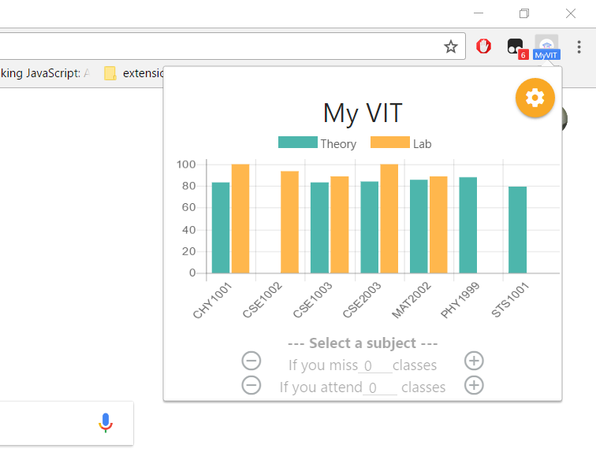
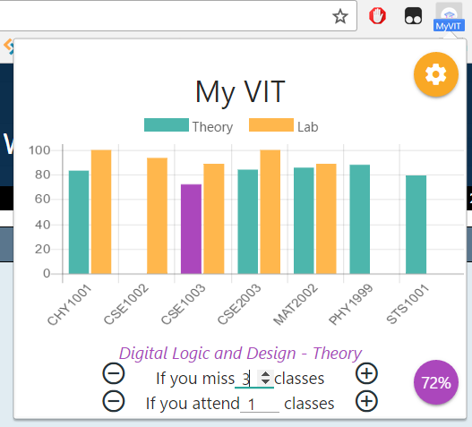

# MyVIT-chrome
Minimalistic port of the My VIT app for the web

## Downloads :
### -> Release [(V 1.1.0)](https://chrome.google.com/webstore/detail/my-vit/mlfcodpjdcbjmmadjhegigifalklgbnm?hl=en-US)
### -> Beta -(crx file)- [(V 2.0.0)](https://github.com/technophilic/MyVIT-chrome/blob/master/beta.crx?raw=true)

## Features :
### Check your attendance from any page. It is literally one click away !
.
### Manipulation module to predict your attendance if you attend or miss a few classes.
.
### Type your credentials once and you are good to go.
.

## Developers :
### Frontend
* **[Vineeth](https://github.com/technophilic)** (Lead Developer)

### Backend
* **[Ujjwal Ayyangar](https://github.com/UjjwalAyyangar)**

## Credits :
* Priyansh Jain - [AutoCaptcha](https://github.com/Presto412/VtopBetaCaptchaParser)